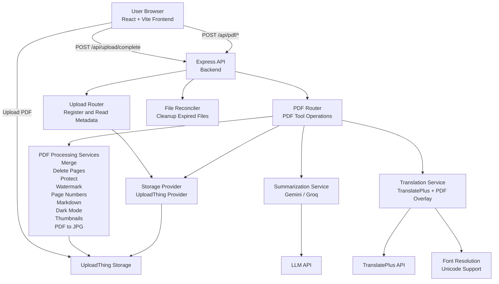

<h1 align="center">Folio</h1>

Folio is a full-stack PDF platform with a React frontend and an Express/TypeScript backend.

No login required

Upload a PDF once, then run tools like summarize, translate, annotate, merge, dark mode conversion, watermarking, page-numbering, protection, markdown export, thumbnail generation, and PDF-to-JPG conversion.

---

## Table of contents

- [The app](#the-app)
- [System architecture](#system-architecture)
- [Core features](#core-features)
- [Backend API surface](#backend-api-surface)
- [Tech stack](#tech-stack)
- [Run locally](#run-locally)
- [Environment variables](#environment-variables)
- [Notes and operational behavior](#notes-and-operational-behavior)


---

## The app

1. Upload a PDF from the frontend.
2. The file is stored via UploadThing and registered in backend storage.
3. Pick a tool (summarize, translate, dark mode, merge, etc.).
4. Backend processes the file and uploads the result as a new artifact.
5. Frontend receives a new download URL and lets users download instantly.

All flows are centered around `fileId`-based operations.

---

## System architecture


## Core features

### AI + language
- **Summarize PDF** with chunked prompt pipeline.
- **Translate PDF** with page-aware overlay rendering.
- Unicode font selection for non-Latin scripts (including Hindi font fallback behavior).

### PDF editing & transforms
- Annotate PDF
- Merge PDFs
- Delete selected pages
- Add watermark text
- Add page numbers
- Protect PDF with password
- Convert PDF to Markdown
- Dark mode conversion (text-aware/image-safe behavior)
- Generate thumbnails
- Convert PDF to JPG (ZIP)

### UX and platform behavior
- Drag/drop upload flows
- Tool-specific modals and validation
- Shared `fileId` workflow for consistent tool chaining
- Configurable API base URL from frontend env

---

## Tech stack

### Frontend (`frontend/`)
- React 19 + TypeScript + Vite
- TailwindCSS
- `pdfjs-dist` for browser rendering and previews
- Fabric.js for annotation interactions
- UploadThing React helpers

### Backend (`backend/`)
- Node + Express + TypeScript
- `pdf-lib` / `@cantoo/pdf-lib` + `@pdf-lib/fontkit`
- `pdfjs-dist` for extraction/rendering pipelines
- UploadThing server SDK
- AI integrations for summarize + translation

---

## Run locally

Open two terminals.

### 1) Backend
```bash
cd backend
npm install
npm run dev
```
Backend defaults to `http://localhost:3001`.

### 2) Frontend
```bash
cd frontend
npm install
npm run dev
```
Frontend defaults to Vite local server and calls `VITE_API_URL` (or `http://localhost:3001`).

### Production builds
```bash
cd backend && npm run build && npm run start
cd frontend && npm run build && npm run preview
```

---

## Environment variables

### Frontend
- `VITE_API_URL` — backend base URL (e.g. `https://your-backend.example.com`)

### Backend (important)
- `PORT` (optional)
- `FILE_LIFETIME_MINUTES` (optional)
- `SUMMARIZE_RATE_LIMIT_PER_DAY` (optional)
- `UPLOAD_RATE_LIMIT_PER_DAY` (if used in your deployment config)
- `PAGES_PER_CHUNK` (optional summarize tuning)

### Backend (required for features)
- `GROQ_API_KEY` **or** `GEMINI_API_KEY` (summarization path)
- `TRANSLATE_API_KEY` or `translate_api_key` (translation provider)

### Optional translation font overrides
- `PDF_TRANSLATION_FONT_PATH`
- `PDF_TRANSLATION_FONT_<LANG>_PATH` (example: `PDF_TRANSLATION_FONT_HI_PATH`)

### UploadThing
Set UploadThing credentials required by your UploadThing setup (server-side environment).


---

## Notes and operational behavior

- File records are time-bound and cleaned up by a reconciler.
- API is proxy-aware (`trust proxy`) for production deployments.
- Frontend and backend pin `pdfjs-dist` to the same version (`5.7.284`) to avoid API/worker mismatch issues.
  

---
